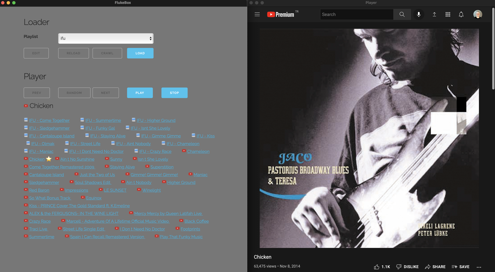

# FlukeBox

FlukeBox is a cross-streaming-service audio player. Here is how it works:
- You provide your Spotify / YouTube / local playlists
- FlukeBox Crawler extracts and stores individual songs from those playlists
- FlukeBox Player plays / shuffle songs; cross-service

So you can mix and match Spotify, YouTube or local files in FlukeBox Player.



## Registration

### Spotify

If you want to access Spotify playlists:
- Go to [Spotify Dashboard](https://developer.spotify.com/dashboard/applications) and create a new application called "Flukebox"
- Note your client id, client secret and redirect uri

### YouTube

If you want to access Youtube playlists:
- Go To [Google Developers Console](https://console.developers.google.com) and create a new application called "Flukebox"
- Click "Enable APIs and Services" and add "YouTube Data API v3"
- Note your app key listed under "YouTube Data API v3" - "Credentials"

## Installation

- Install Python First. The program won't work unless you install Python.  [Click here](https://www.python.org/downloads/mac-osx/) to install Python. [The official Python docs](https://docs.python.org/3/using/mac.html) are good enough to help you through the installation.

- Create a folder (presumably called flukebox), and download all of the files in this repository there

- Open a terminal window, go to the flukebox folder and type the following commands:

```
python3 -m venv venv
```

- Install dependencies

```
. venv/bin/activate
pip install flask
pip install pywebview
```

- Create a secondary folder (presumably called config) to store configuration and cache files later on.

- Go to flukebox/cpp folder and build cpp_toolkit.cpp; possibly by:
```
g++ -c -fPIC cpp_toolkit.cpp -o cpp_toolkit.o
g++ -shared -o cpp_toolkit.so cpp_toolkit.o
```

## Configuration

In the "config" folder, create a file called **config.json** in the following intuitive format, changing your values accordingly:

```
{
    "paths": [
        {
            "name": "backing.real_book",
            "host": "youtube",
            "url": "https://www.youtube.com/watch?v=5xINc3rfbBg&list=PLES3BCUQLP6hBBIODciynJr7VAgXSbonF"
        },
        {
            "name": "flat.jj",
            "host": "spotify",
            "url": "spotify:playlist:2D8xR8Ls9PsnEhNeThot7r"
        },
        {
            "name": "jozi.cesme",
            "host": "local",
            "url": "/Users/kerem/Documents/music/itunes/Jozi Levi Brazil Project/2011 - Cesme"
        }
    ],
    "playlists": [
        {
            "name": "backing",
            "paths": ["backing.real_book"]
        },
        {
            "name": "repertoir",
            "paths": ["flat.jj", "jozi.cesme"],
            "playlists": []
        },
        {
            "name": "everything",
            "paths": ["backing.real_book"],
            "playlists": ["repertoir]
        }
    ],
    "hosts": {
        "local": {
            "extensions": ["mp3", "m4a", "mp4"]
        },
        "spotify": {
            "client_id": "YOUR_SPOTIFY_CLIENT_ID",
            "client_secret": "YOUR_SPOTIFY_CLIENT_SECRET",
            "redirect_uri": "YOUR_SPOTIFY_REDIRECT_URI",
            "cache_file": "spotify_token.json"
        },
        "youtube": {
            "key": "YOUR_YOUTUBE_KEY"
        }
    },
    "settings": {
        "output_file": "/Users/kerem/Downloads/flukebox_player.html"
    }
}
```

Edit **/path.json** so **data_path** points your config directory.

## Starting the program

### Windows

Simply run main.py. You can run main.py from the command line by typing:

```
cd flukebox
venv\Scripts\activate.bat
python3 main.py
```

Obviously, you should change the folder name flukebox with your own installation path. Feel free to create a .bat file including this command for easy startup.

### Mac / Linux

Simply run main.py. You can run main.py from the command line by typing:

```
cd flukebox
. venv/bin/activate
python3 main.py
```

Obviously, you should change the folder name flukebox with your own installation path. Feel free to create a .sh file including this command for easy startup.

## Using the program

The program interface is very simple and intuitive.
- **Edit** lets you edit your config.json file
- **Crawl** crawls through Spotify / YouTube / local directories and builds a song list, which can be seen in **config/song.json** if needed.
- **Play** opens the player in your browser, which will play the files of the selected playlist.

## Command line arguments

### Generate for a playlist

```
main.py playlist=kerem
```

This will start the program, generate the player for the playlist called "kerem" and quit.

### Generate seeking songs

```
main.py seek=/folder/seek.json
```

This will start the program, seek the songs given in the JSON file, generate the player quit.

Provided file (seek.json) should be in the following intuitive format:

```
{
    "seek_songs": ["Mercedes Benz", "Walking Myself", "Dummy Song"],
    "seek_in_playlists": ["pinyata"]
}
```